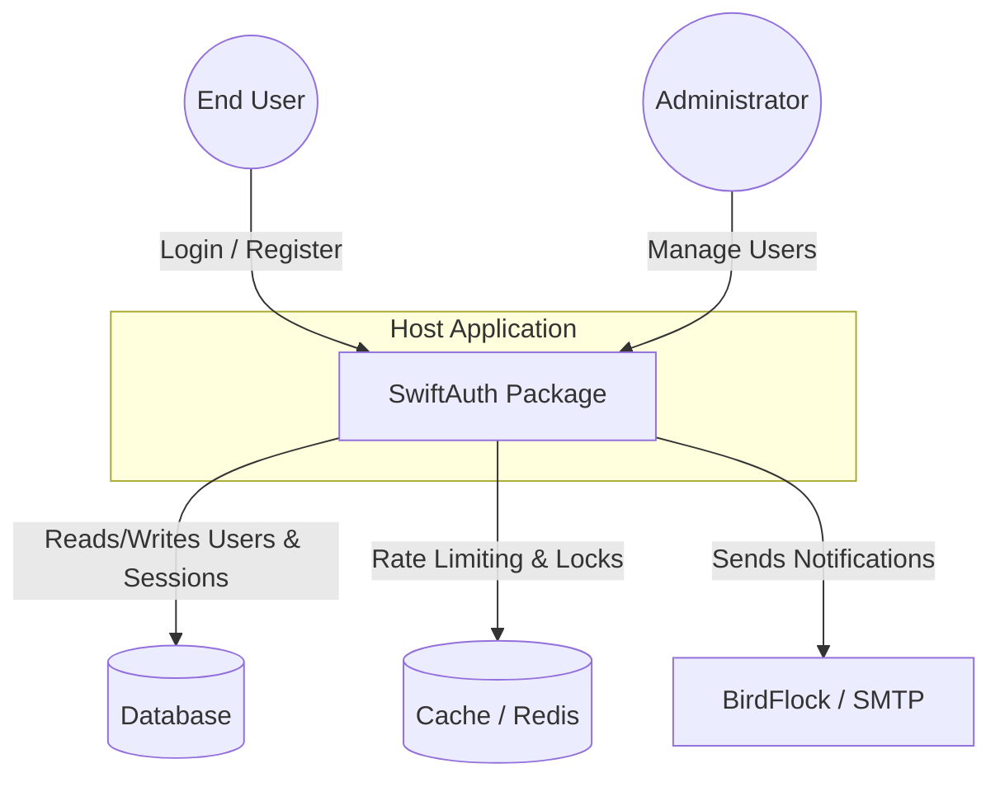
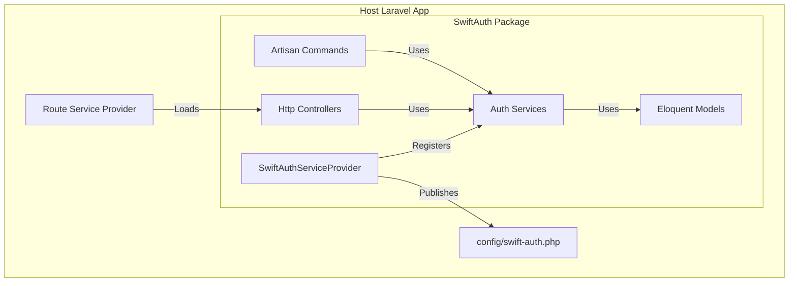
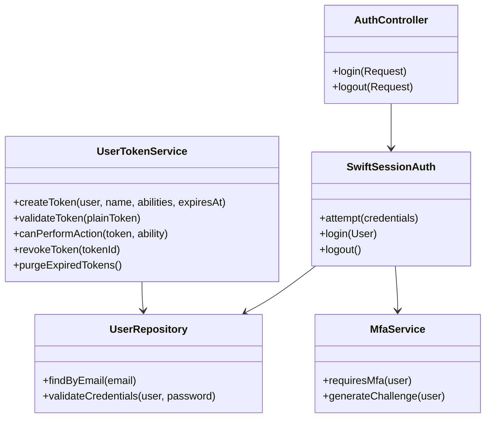
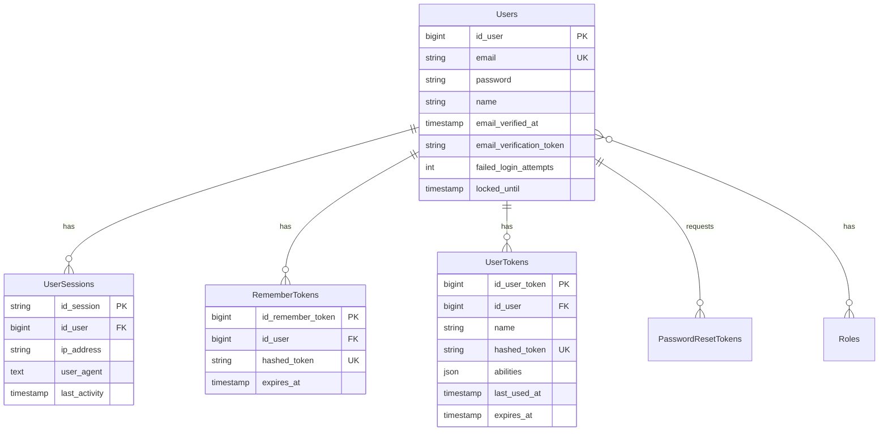

# Architecture Diagrams

## System Context Diagram

```mermaid
flowchart TD
    User((End User))
    Admin((Administrator))

    subgraph "Host Application"
        SA[SwiftAuth Package]
    end

    DB[(Database)]
    Cache[(Cache / Redis)]
    Email[BirdFlock / SMTP]

    User -->|Login / Register| SA
    Admin -->|Manage Users| SA

    SA -->|Reads/Writes Users & Sessions| DB
    SA -->|Rate Limiting & Locks| Cache
    SA -->|Sends Notifications| Email
```

## Container Diagram (Package Integration)

```mermaid
flowchart TD
    subgraph "Host Laravel App"
        Route[Route Service Provider]
        Config[config/swift-auth.php]

        subgraph "SwiftAuth Package"
            SP[SwiftAuthServiceProvider]
            Controllers[Http Controllers]
            Services[Auth Services]
            Models[Eloquent Models]
            Cmds[Artisan Commands]
        end
    end

    Route -->|Loads| Controllers
    SP -->|Registers| Services
    SP -->|Publishes| Config

    Controllers -->|Uses| Services
    Cmds -->|Uses| Services
    Services -->|Uses| Models
```

## Component Diagram (Core Auth Flow)

```mermaid
classDiagram
    class AuthController {
        +login(Request)
        +logout(Request)
    }

    class SwiftSessionAuth {
        +attempt(credentials)
        +login(User)
        +logout()
    }

    class UserRepository {
        +findByEmail(email)
        +validateCredentials(user, password)
    }

    class MfaService {
        +requiresMfa(user)
        +generateChallenge(user)
    }

    class UserTokenService {
        +createToken(user, name, abilities, expiresAt)
        +validateToken(plainToken)
        +canPerformAction(token, ability)
        +revokeToken(tokenId)
        +purgeExpiredTokens()
    }

    AuthController --> SwiftSessionAuth
    SwiftSessionAuth --> UserRepository
    SwiftSessionAuth --> MfaService
    UserTokenService --> UserRepository
```

## Data Model (Core Entities)

```mermaid
erDiagram
    Users ||--o{ UserSessions : has
    Users ||--o{ RememberTokens : has
    Users ||--o{ UserTokens : has
    Users ||--o{ PasswordResetTokens : requests
    Users }o--o{ Roles : has

    Users {
        bigint id_user PK
        string email UK
        string password
        string name
        timestamp email_verified_at
        string email_verification_token
        int failed_login_attempts
        timestamp locked_until
    }

    UserTokens {
        bigint id_user_token PK
        bigint id_user FK
        string name
        string hashed_token UK
        json abilities
        timestamp last_used_at
        timestamp expires_at
    }

    UserSessions {
        string id_session PK
        bigint id_user FK
        string ip_address
        text user_agent
        timestamp last_activity
    }

    RememberTokens {
        bigint id_remember_token PK
        bigint id_user FK
        string hashed_token UK
        timestamp expires_at
    }
```
