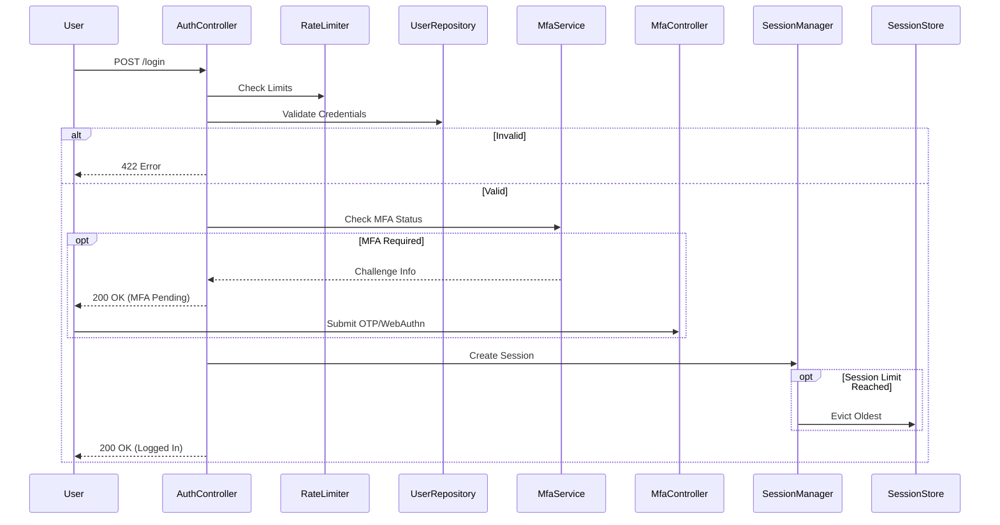

# Business Logic & Core Processes

## 1. User Login Flow

Authenticated access to the system.

**Process:**
1.  User submits credentials (Email + Password).
2.  Rate limits are checked (IP & Email).
3.  Credentials validated against Database.
4.  **Check:** Is MFA enabled and configured for user?
    - **Yes:** Store partial session, issue MFA challenge, return "MFA Required" response.
    - **No:** Create full session, log user in.
5.  **Check:** Is Concurrent Session Limit enabled?
    - **Yes:** Check active sessions count.
    - If limit exceeded, evict oldest/newest session based on policy.
6.  Return auth token or session cookie.

## 2. Password Reset Flow

Secure account recovery.

**Process:**
1.  User requests reset for Email.
2.  Rate limit check.
3.  Token generated (Server-side hash stored).
4.  Notification dispatched (BirdFlock).
5.  User clicks link → validates token → enters new password.
6.  Password updated, User logged in (optional flow), Tokens cleared.

## 3. Account Lockout

Brute-force protection mechanism.

**Rules:**
- **Trigger:** 5 failed attempts (configurable) within 5 minutes.
- **Action:** Lock account for 15 minutes.
- **Notification:** Send "Account Locked" email via NotificationService.
- **Resolution:** Wait for timer expiration or admin manual unlock (`swift-auth:unlock-user`).
